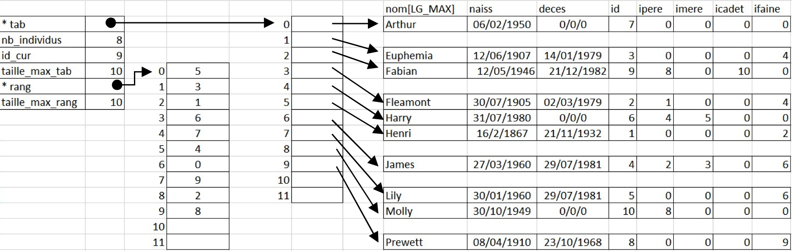

# TreeDataStructure implementation in C language

A C program for managing family genealogy trees. This project allows you to create, modify, and visualize family relationships across multiple generations.
Features:

1. Add individuals with birth/death dates
2. Link parents, children, and siblings
3. Find family relationships (siblings, cousins, uncles/aunts)
4. Display ancestry and descendance
5. Trace lineage across generations

Structure:
The program uses a specialized data structure to represent family relationships with bidirectional links between individuals, allowing for efficient traversal of the family tree in any direction. As an exemple, I took the Harry Poter genealogy.


Usage:
Download the repository and run the make file to assemble:
```bash
make    	#to assemble
make run	#to run
make clean	#clean the repository from object files
``` 

## 🤝 Contributions & Feedback  
Got a better solution or suggestions? Open a Pull Request or reach out!  

📧 Email: iveverita@icloud.com  
